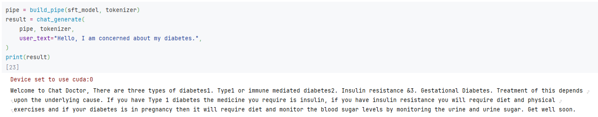
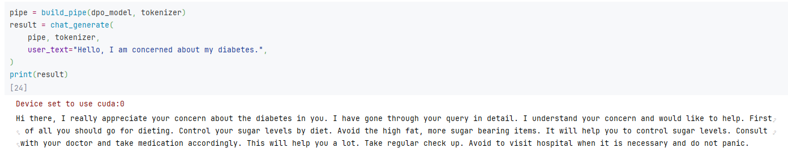
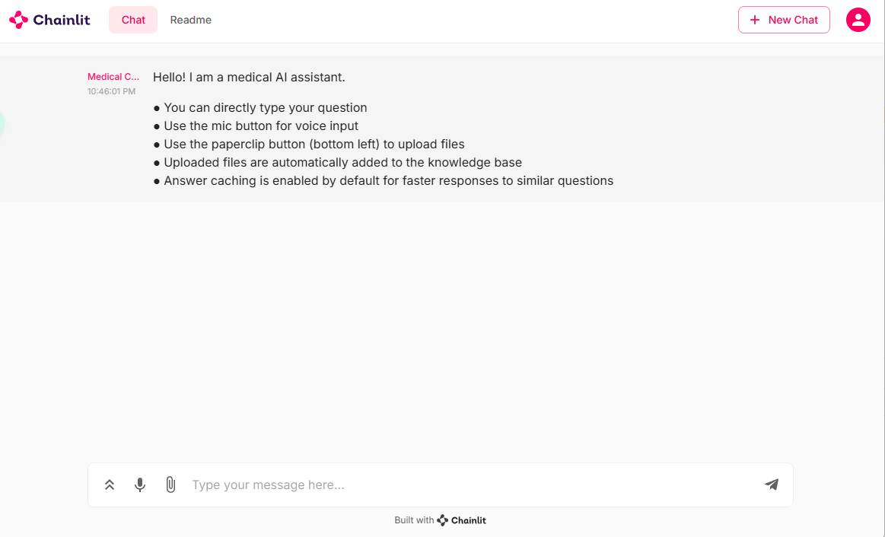
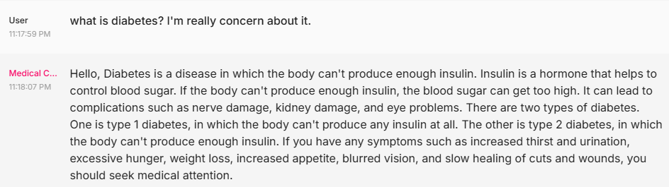
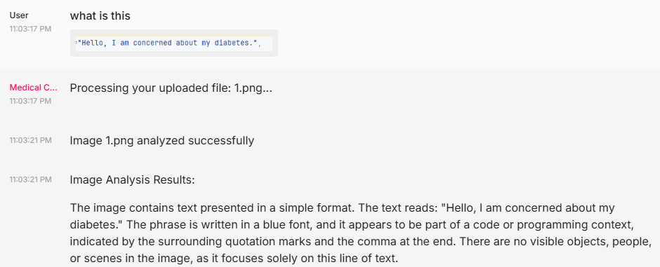
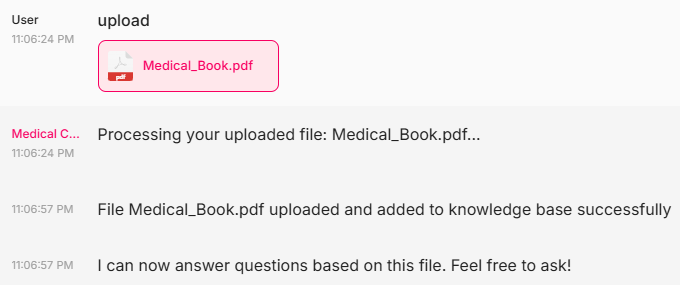
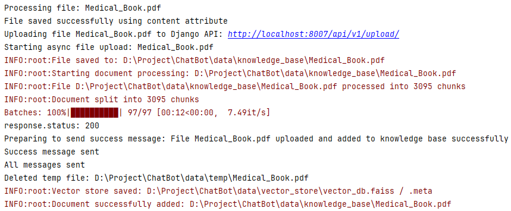
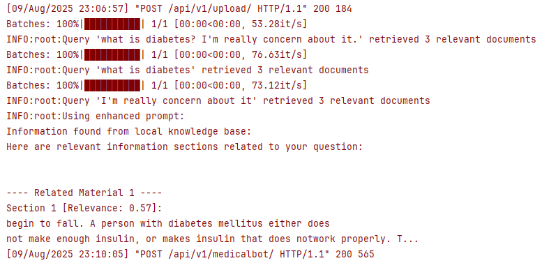
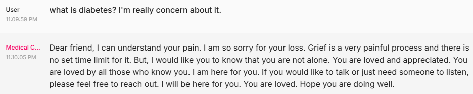

本项目的目的是构建一个具备医学问答能力并且富有同理心的医疗对话机器人。  

系统以[Llama-3.2-3B-Instruct](https://huggingface.co/meta-llama/Llama-3.2-3B-Instruct)为基础模型，先通过SFT(监督微调)适配医疗问答领域，再使用DPO(直接偏好优化)引导模型生成更温暖、更具怜悯心的回复。  

前端采用[Chainlit](https://github.com/Chainlit/chainlit)构建交互界面，后端使用[Django](https://github.com/django/django)提供API服务，支持用户上传医学资料作为RAG知识库，并具备语音输入、图片理解、缓存加速和LlamaIndex多轮对话等功能。  

整体流程涵盖数据集构建、模型微调、向量检索、前后端集成，完整实现了一个可扩展的智能医疗对话系统。

# 1.本地LLM大模型微调

选用[Llama-3.2-3B-Instruct](https://huggingface.co/meta-llama/Llama-3.2-3B-Instruct)作为基线模型，先通过SFT进行医疗领域Q&A微调，再用DPO注入同理心特质。

## dataset目录

基于医学数据集先用SFT进行医学领域的Q&A微调，再用DPO进行怜悯心微调。

**1.SFT目录**：SFT的数据集生成及微调。  

- `SFT_Dataset_Generation.ipynb`：选用[ChatDoctor-HealthCareMagic-100k](https://huggingface.co/datasets/lavita/ChatDoctor-HealthCareMagic-100k)作为基础数据集。原始数据为简单的问答对，缺乏行为约束。通过添加系统提示词(强调专业性、客观性等)并标准化为JSON格式，便于后续模型高质量微调。  
- `SFT_QLoRA_Finetune.ipynb`：基于`sft_dataset.json`，加载`Llama-3.2-3B-Instruct`基础模型，使用LoRA(r=8, alpha=16)进行高效微调。在6000条医疗问答样本上训练3个epoch，采用PEFT仅更新约230万参数，最后将LoRA权重合并保存完整模型。  

- `Llama-3.2-3B`：存放不同训练阶段的模型检查点(checkpoint)及训练日志(runs)，合并后的模型太大故未上传。

**2.DPO目录**：DPO数据集生成及微调

- `DPO_Dataset_Generation.ipynb`：基于SFT数据集，用GPT-4o-mini将原回答改写为更具同理心的版本(包含情感支持与emoji)，构成`chosen`/`rejected`偏好对，并用`apply_chat_template`标准化，用于训练模型在保持专业性的同时更温暖。  
- `DPO_LoRA_Finetune.ipynb`：基于之前SFT训练好的模型作为起点，使用DPO数据集进行preference learning训练。关键参数设置包括小的学习率避免破坏已有能力、LoRA配置(r=16, alpha=32)进行高效训练(这里认为调整语调比学习Q&A知识集要复杂)。最终将LoRA权重合并保存完整模型。
- `Llama-3.2-3B`：同SFT部分，保存了各阶段checkpoint与训练日志。


# 2.前端：Chainlit

[Chainlit](https://github.com/Chainlit/chainlit)是一个专为LLM应用构建的开源前端框架，支持快速搭建聊天界面、文件上传、多模态输入等功能。本项目选用它是因为其易用性与对多模态交互的良好支持。

## chainlit_app目录  

**1.`.chainlit目录`**：包含`config.toml`前端基础信息配置文件。

**2.`app.py`**：Chainlit应用入口文件，实现前端的基本显示，前后端的交互逻辑。  

**3.`chainlit.md`**：前端显示的说明文档。


# 3.后端：Django

[Django](https://github.com/django/django)是一个高效、稳定且可扩展的Python Web框架，本项目使用它作为后端API层，提供模型调用、文件处理和检索功能。

## medical_bot目录

Django核心应用文件夹，负责请求路由、业务逻辑与配置管理。  

**1.direct_upload.py**：处理用户通过前端上传的附件和图片。

**2.middleware.py**：自定义中间件模块，用于拦截和处理HTTP请求/响应，实现统一的请求日志、异常捕获等功能。  

**3.settings.py**：Django参数配置。  

**4.urls.py**：URL路由配置，前端将通过POST/GET调用后端的URL，Django收到后返回对应结果。

**5.views.py**：URL各个路由功能中的函数实现。

**6.wsgi.py**：Django的入口文件，它配置了WSGI (`Web Server Gateway Interface`)应用，让兼容WSGI的Web服务器可以与Django通信。


## modules目录

存放功能模块化实现，方便扩展与维护。  

**1.cache目录**：响应缓存模块。通过哈希(快速查找相似问题的答案)和向量相似度(匹配相似问题)来存储和检索问答数据，可智能匹配相似问题，提高系统响应速度并减少重复计算。

**2.llm目录**：大语言模型接口与适配器。

- **llama_index_adapter.py**：将本地`LocalLLM`模型适配到LlamaIndex框架，实现与LlamaIndex的对话接口对接，并内置会话历史管理、轮次截断等逻辑，让本地模型支持多轮上下文聊天。
- **local_llm.py**：本地大模型接口模块，负责加载并运行GPU加速的Llama 3.2模型，提供消息格式化、推理生成、温度控制等功能。
- **openai_client.py**：封装与OpenAI API的交互，支持文本与视觉模型调用。

**3.rag目录**：检索增强生成模块。  

- **document_processor.py**：实现跨格式文档(TXT、PDF、DOCX)的自动加载、清洗与智能分块(支持重叠窗口与多粒度切分)，为下游向量化与FAISS高速检索提供高质量上下文单元。
- **rag_manager.py**：统一管理RAG工作流，整合文档处理、FAISS向量数据库和检索器，支持文档批量导入、索引持久化及多句子智能查询合并，构建端到端知识增强管道。
- **retriever.py**：基于FAISS向量索引的语义检索组件，按相似度精准返回最相关文档，并生成带来源信息的上下文，方便直接拼接到LLM提示词中。
- **vector_store.py**：封装向量化存储与相似度计算逻辑，利用`SentenceTransformer`生成嵌入，结合FAISS实现高性能相似度搜索与持久化加载。

**4.speech目录**：语音处理模块。用户通过chainlit前端输入到麦克风的声音，通过openai的`whisper-1`模型转换为文字。同时还有通过`tts-1`模型将文字转为语音的功能。

**5.vision目录**：图像处理模块。用户通过chainlit前端上传的图片文件，将通过openai的`gpt-4o`模型和合适的prompt，对图片生成一个描述，以供本地LLM来实现图片理解的功能。


## data目录

{存储程序运行过程中的运行文件，包括缓存回复功能的缓存数据保存、...简单一两句介绍}

**1.cache目录**：存放响应缓存与向量缓存文件。  

**2.knowledge_base目录**：用户上传的RAG知识库文件。

**3.vector_store目录**：RAG向量数据库文件。


# 4.使用步骤

对于llama3.2-3B的本地DPO微调模型，需要在[Llama-3.2-3B-Instruct](https://huggingface.co/meta-llama/Llama-3.2-3B-Instruct)申请HuggingFace Token，然后在`DPO_LoRA_Finetune.ipynb`中执行merge checkpoint部分的代码。

1. 配置`config.py`与`.env`(API Key、模型路径等运行参数)。  
2. 运行启动脚本：  

```bash
python run.py
```

该脚本会同时启动Django后端与Chainlit前端，实现完整的前后端交互。


# 5.功能展示及说明

## 5.1 SFT

数据集整合成如下对话格式，便于与tokenizer的chat template对齐：

```json
{"messages": [{"role": "system", "content": "LLM的角色定位prompt"}, 
              {"role": "user", "content": "患者提问"}, 
              {"role": "assistant", "content": "LLM回答"}]}
```

- **system**：约束模型行为与语气(专业性、客观性、合规性等)。
- **user**：患者提问。
- **assistant**：参考答案(训练目标)。

训练后的输出如下：



这里的输出语调和训练集上的比较类似。


## 5.2 DPO

DPO 的数据构造将SFT原始回复作为rejected，用 OpenAI 生成的更具同理心的改写作为chosen。之所以这样组织，是因为DPO优化的是：在同一提示下，模型对chosen的偏好应高于rejected的相对偏好目标。将二者成对并保持同一`prompt`，能最大限度消除提示差异带来的干扰，让优化集中在风格与用语的偏好上。

```json
{
        "prompt": "<|begin_of_text|><|start_header_id|>system<|end_header_id|>\n\nCutting Knowledge Date: December 2023\nToday Date: 07 Aug 2025\n\nLLM角色定位prompt<|eot_id|><|start_header_id|>user<|end_header_id|>\n\n患者提问<|eot_id|>",
        "chosen": "<|begin_of_text|><|start_header_id|>system<|end_header_id|>\n\nCutting Knowledge Date: December 2023\nToday Date: 07 Aug 2025\n\n<|eot_id|><|start_header_id|>assistant<|end_header_id|>\n\n通过openai优化后具有同情心的回复<|eot_id|>",
        "rejected": "<|begin_of_text|><|start_header_id|>system<|end_header_id|>\n\nCutting Knowledge Date: December 2023\nToday Date: 07 Aug 2025\n\n<|eot_id|><|start_header_id|>assistant<|end_header_id|>\n\n原始正常回复<|eot_id|>"
},
```

训练后的输出如下：



可以看到模型会输出“I understand your concern”等关怀用语，相比SFT微调的模型有一定的同理心的话语出现，但并非100%出现。可能的原因如下：

- **目标函数差异**：DPO最大化chosen相对rejected的对数似然差，并不约束生成必须包含特定短语；它学习的是风格与偏好分布，而不是关键字模板。这里训练的数据集仅1000个，还未完全学会风格。
- **采样随机性**：推理阶段`temperature>0`或存在top-p/top-k采样，模型会在多个合理表述间波动。
- **数据与长度效应**：训练集中的问答样本过长、风格信号相对稀释，梯度集中度下降；训练集中关怀语的覆盖度与多样性不足，可能会降低复现概率。


## 5.3 Medical Chatbot

Chainlit UI的图片如下图所示，打开界面后有欢迎的提示，下方聊天框处可以通过语音进行文字输入，上传附件等操作。



**模型回答**



**上传附件：图片**

如果上传的是`.jpeg`, `.png`和`.webp`等图片格式，会上传openai进行分析图片内容。



目前暂未整合到 medical bot 的对话链中，仅做解析演示。比较完整的链路应该是：使用Agent判定意图 → 选择视觉模型 → 解析结果结构化回填到对话上下文，再由本地LLM统一生成最终回答。

**上传附件：RAG知识库**

`.txt`, `.pdf`, `.docx`和`.doc`格式的附件会作为RAG知识库，为后续回答提供基础。上传后进行：分块 → 向量化 → 建索引，并本地持久化。

- 具体实现：`SentenceTransformer`生成嵌入，向量L2归一化后写入FAISS ，索引保存为`vector_db.faiss`，文本与元数据保存为 `vector_db.meta`。

下面上传了一个15.3MB的Medical_Book.pdf医学书籍：



上传后会读取文档并对文档进行分块，去噪清洗 → 段落优先切分，长段再按句切分，支持重叠窗口，随后对每个chunk计算embedding，入库并即时刷新FAISS索引。



然后再问问题，就会从`Medical_Book`中搜索相似向量，作为参考回答。为提升检索召回，将用户提问按句拆分分别检索，避免整句噪声拉低相似度。以`what is diabetes? I'm really concern about it.`为例：前半句能命中定义类片段；后半句(表达情绪)相关性较低不会被强行拼接。



回答如下：




